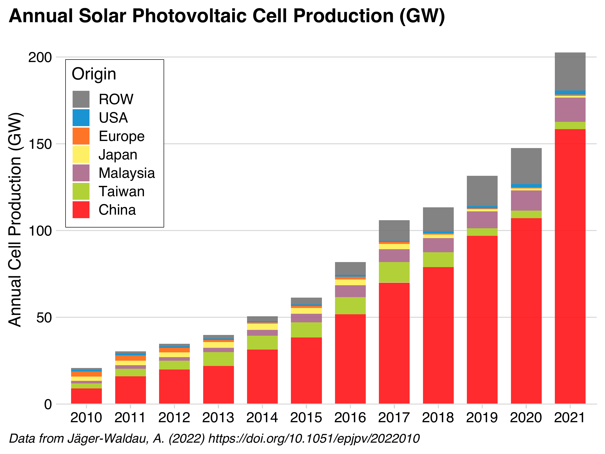
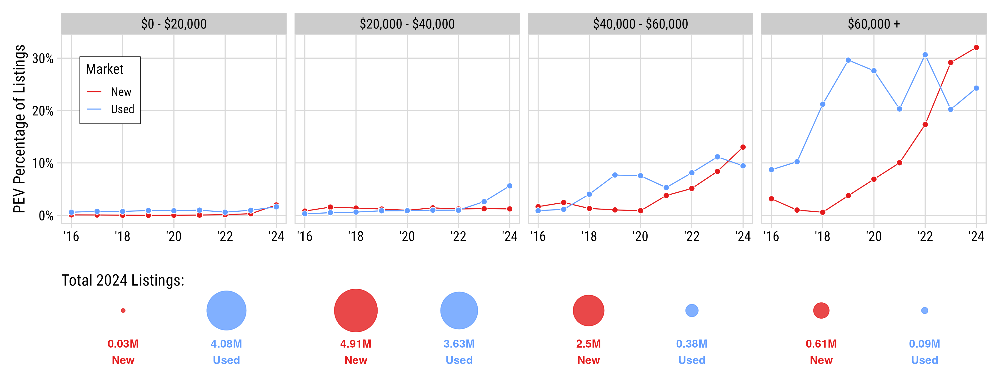
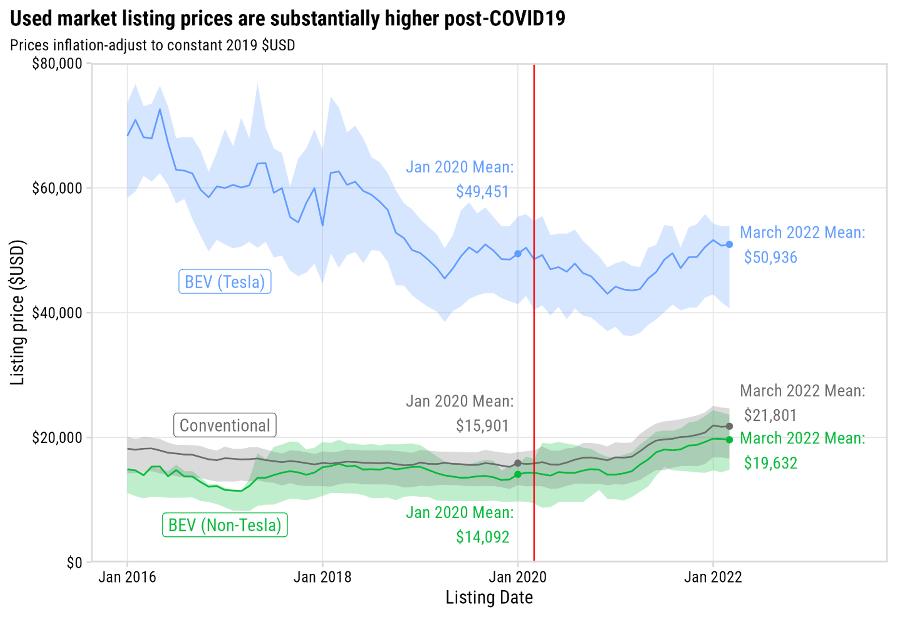

```{r, child="setup.Rmd"}
```

layout: true

<!-- this adds the link footer to all slides, depends on my-footer class in css-->

<div class="footer-small">
<span>
© John Paul Helveston, The George Washington University, Apr. 2025
</span>
</div>

---

background-image: url("images/blue.jpg")
background-size: cover
class: inverse

<br><br><br><br>

## `r rmarkdown::metadata$title`

<br><br><br><br>

**.white[John Paul Helveston]**, George Washington University

`r rmarkdown::metadata$date`

---

## .center[Chinese firms dominate EV and solar industries]

.leftcol[

#### .center[EV sales (Jul. '23 - Dec. '24)]

<center>

</center>

https://www.reuters.com/business/autos-transportation/global-electric-vehicle-sales-up-25-record-2024-2025-01-14/

]

.rightcol[

#### .center[Solar module production ('10 - '21)]

<center>

</center>

Helveston, J.P., He, G., & Davidson, M.R. (2022) “Quantifying the cost savings of global solar photovoltaic supply chains” _Nature_.

]

---

## .center[Chinese firms dominate EV and solar _supply chains_]

.leftcol[

#### .center[EV battery supply chain]

<center>

</center>

Cheng, Anthony L., et al. "Electric vehicle battery chemistry affects supply chain disruption vulnerabilities." Nature Communications 15.1 (2024): 2143.

]

.rightcol[

#### .center[Solar module supply chain]

<center>

</center>

IEA Special report 2022: Solar PV Global Supply Chains, https://www.iea.org/reports/solar-pv-global-supply-chains

]

---

# .center[**Bipartisan goal**: The US needs to counter China's lead in clean energy tech]

<br>

--

## **Keep Chinese clean tech out of US market**: Steep tariffs on imported Chinese EVs, batteries, PV modules

--

## **Keep Chinese firms out of US clean tech supply chains**: IRA restrictions on EV subsidy elligiblity, unclear guidance on Foreign Entities of Concern (FEOC) rules

---

# .center[Countering China by Investing in Manufacturing]

<br>

## **IRA Strategy**: Investing in *manufacturing* will lead to enduring support for clean tech through local jobs & economic benefits

--

## **To what extent are counter-China policies helping or harming the clean tech manufacturing goal?**

---

class: inverse, middle, center

# Solar PV

---

## Solar PV

### Total available U.S. federal subsidies: $0.16 / W

### Average U.S. module price (Q1 2024): $0.33 / W

<br><br><br><br>

Sources:

- https://www.nrel.gov/docs/fy24osti/91209.pdf
- Michael Davidson, “U.S.-China Clean Energy Race: Accelerating Innovation, Manufacturing and Adoption”, https://web.sas.upenn.edu/future-of-us-china-relations/climate-and-environment/

---

## Solar PV

### Total available U.S. federal subsidies: $0.16 / W

### Average U.S. module price (Q1 2024): $0.33 / W

### Average cost of production in China: **$0.10 / W**

<br><br>

Sources:

- https://www.nrel.gov/docs/fy24osti/91209.pdf
- Michael Davidson, “U.S.-China Clean Energy Race: Accelerating Innovation, Manufacturing and Adoption”, https://web.sas.upenn.edu/future-of-us-china-relations/climate-and-environment/

---

## Solar PV

### Total available U.S. federal subsidies: $0.16 / W

### Average U.S. module price (Q1 2024): $0.33 / W

### Average cost of production in China: $0.10 / W

### **Risk: U.S. producers unlikely to be globally competitive**

Sources:

- https://www.nrel.gov/docs/fy24osti/91209.pdf
- Michael Davidson, “U.S.-China Clean Energy Race: Accelerating Innovation, Manufacturing and Adoption”, https://web.sas.upenn.edu/future-of-us-china-relations/climate-and-environment/

---

background-color: #fff

## Solar unlikely to produce desired # of manufacturing jobs

.leftcol70[

<center>

</center>

]

.rightcol30[

### Installation and project development accounts for 2/3 of solar jobs.

### **Manufacturing is 12% of solar jobs**

.footer[https://irecusa.org/census-solar-job-trends/]

]

---

# We need diversification

## China has enough solar PV capacity to meet annual global demand through 2032.

Source: Wood Mackenzie, https://www.reuters.com/world/china/china-will-dominate-solar-supply-chain-years-wood-mackenzie-2023-11-07/

--

<br>

## But do we need _onshoring_?

---

#### .center[Estimated $67 B in savings from global supply chains]

<center>

</center>

Source: Helveston, J.P., He, G., & Davidson, M.R. (2022) “Quantifying the cost savings of global solar photovoltaic supply chains” _Nature_. 612 (7938), pg. 83-87. DOI: [10.1038/s41586-022-05316-6](https://doi.org/10.1038/s41586-022-05316-6)

---

class: inverse, middle, center

# Electric Vehicles

---

background-color: #fff

<center>

</center>

---

background-color: #fff

## .center[EV sales in US reaching ~10% of sales]

<center>

</center>

.font80[Source: Argonne National Lab, https://www.anl.gov/ev-facts/model-sales]

---

class: center
background-color: #fff

.leftcol70[

<center>

</center>

.font70[Source: https://www.iea.org/reports/global-ev-outlook-2024/executive-summary]

]

.rightcol30[

### The EV sector has an affordability problem<br>(except in China)

]

---

class: center
background-color: #fff

## BEVs Concentrated in High-Price Segments in US

<br>

.font120[In 2024, BEVs just 1.8% of new and 0.4% of used listings under $45,000]

<center>

</center>

<br>

.font80[Data pulled from >60k dealerships, 2016 to 2021. Source: marketcheck.com]

---

class: center
background-color: #fff

# The BEV Deserts of America

<center>

</center>

---

# Things that don't help affordability:

<br>

--

## Tariffs (100% tariff on imported Chinese EVs since 05/2024)

--

<br>

## Effectively banning the use of Chinese suppliers 

--

<br>

## Inflation (see tariffs)

---

## **Opportunities**

.leftcol[

## Chinese FDI into U.S.

### **Gotion batteries**: Multi-billion dollar investments in Illinois and Michigan

### **Challenge**: Uncertainty around Foreign Entities of Concern (FEOC) status

]

--

.rightcol[

## Technology Licensing Agreements

### **Ford-CATL**: Licensing battery technology in a Michigan plant

### **Challenge**: CATL was recently added to DOD's list of “Chinese military companies”

]

---

class: middle, center, inverse

# The biggest competitor<br>to an American EV<br>is not a Chinese EV...<br><br>...it's a gas car

---

background-image: url("images/top-four-1.png")
background-size: cover

---

background-image: url("images/top-four-2.png")
background-size: cover

---

class: inverse 
background-image: url("images/blue.jpg")
background-size: cover

<br>

# Thanks!

<br>

### <span class="white-text">https://jhelvy.github.io/2025-jeffries-us-china-summit</span>

<style>
.white-text a {
  color: white !important;
}
</style>

.footer-large[.white[.right[

@jhelvy.bsky.social `r fa(name = "bluesky", fill = "white")`<br>
@jhelvy `r fa(name = "github", fill = "white")`<br>
jhelvy.com `r fa(name = "link", fill = "white")`<br>
jph@gwu.edu `r fa(name = "paper-plane", fill = "white")`

]]]

---

class: inverse, middle, center

# Extra Slides

---

.leftcol75[

<center>

</center>

.font60[Source: Roberson, Laura A., *Pantha, S., & Helveston, J.P. (2024) “Battery-Powered Bargains? Assessing Electric Vehicle Resale Value in the United States” Environmental Research Letters.]

]

.rightcol25[

### .center[Used market is more affordable, but post-COVID prices are up in all markets, not just EVs]

]
